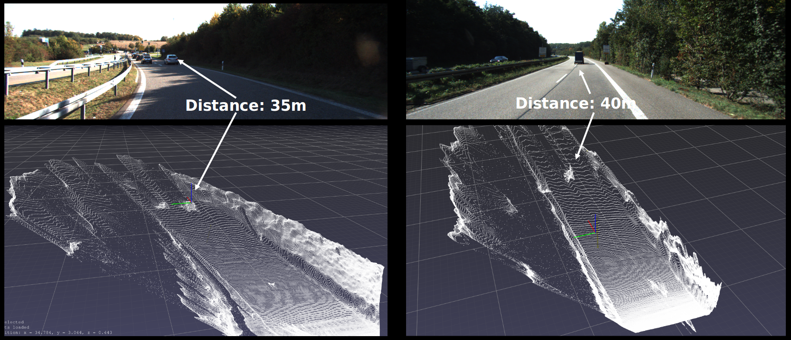

# Testing generating pseudo lidar point clouds from stereo cameras. Based on [Yan Wang et. al.'s implementation](https://github.com/mileyan/pseudo_lidar)

## visualization of the results



## Set up the environment

| package | version |
|  :---:       |     :---:      |
| python   |2.7.12   |
| tensorflow    | 1.13.1   |
| torchvision   | 0.2.0  |
| cv2  | 2.4.9.1   |
| scipy      | 0.17.0      |
| numpy      | 1.14.5     |

> Note that higher version of torchvision might cause problems in generating disparity map: https://github.com/mileyan/pseudo_lidar/issues/7#issuecomment-507674381

## Set up the working directory

Create KITTI folder under the root working directory, and put the KITTI data inside. You may need to create a folder named <predict_disparity> under ./KITTI/object/training and ./KITTI/object/testing folder. For other issues, you may want to refer to the [original repo](https://github.com/mileyan/pseudo_lidar)


## Generating disparity map
```
$ python /home/hyao/Documents/pseudo_lidar/psmnet/submission.py  --loadmodel ./psmnet/kitti_3d/finetune_300.tar    --datapath ./KITTI/object/training/    --save_path ./KITTI/object/training/predict_disparity
```

## Generating disparity map
```
$ python ./preprocessing/generate_lidar.py   --calib_dir ./KITTI/object/training/calib/  --save_dir ./KITTI/object/training/pseudo-lidar_velodyne/  --disparity_dir ./KITTI/object/training/predict_disparity --max_high 1
```

## Visualize the generated pseudo lidar point cloud
```
$ python SAIC/pyutility/show_utility.py  --pc=./KITTI/object/training/pseudo-lidar_velodyne/000013.bin
```

## Potential directions to improve the disparity generation speed and accuracy:
Check out the [paper](https://arxiv.org/abs/1810.05424) and [code](https://github.com/CVLAB-Unibo/Real-time-self-adaptive-deep-stereo) for Real-Time Self-Adaptive Deep Stereo.
An discussion on the limitations and potentials of this idea can be found in the pptx file in this repo.
